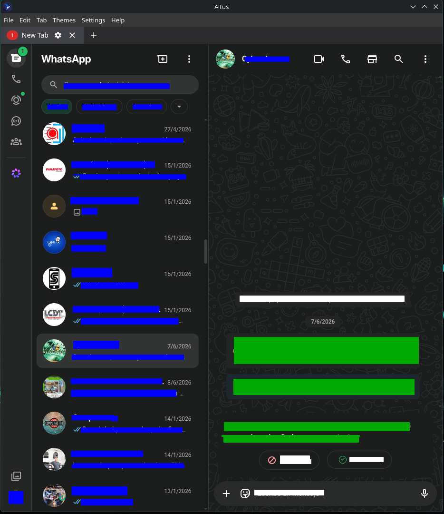

  

# Altus.AppImage Minified, Debloated, Optimized

# Ultra-light AppImage using the native Electron runtime.

# Altus System Electron AppImage

A lightweight AppImage launcher for Altus that uses the Electron runtime installed on your Linux system.

This repository does **not** redistribute Altus source code or bundled Electron.

  

It provides:

- AppRun
- Desktop launcher
- AppImage metadata
- Build scripts
- Debloating scripts
- Documentation

## Features

- Uses native Electron
- Portable
- Minimal AppDir
- Faster startup
- Smaller AppImage
- Easy to rebuild

See:

- BUILD.md
- SYSTEM-ELECTRON.md

Original
~114 MiB
Bundled Electron
Portable
Slower startup	      

vs

Optimized
~1.1 MiB
System Electron
Portable
Faster startup

